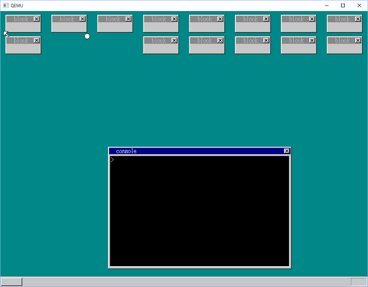
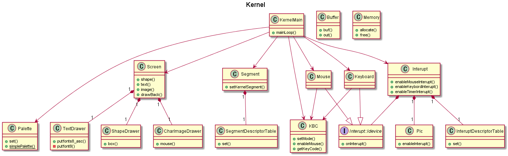

.

.

.

.

.

.

.

.

.

# <center>オペレーティングシステムA特別課題レポート</center>

.

.

.

### <center>1W173092-0 富岡祐介</center>

.

.

.

.

.

.

.

.

.

.

.

.

.

# 制作OS概観

以下に概要を記述する二つのOSは、オペレーティングシステムAの特別課題に向けて制作されたものである。このレポート内で解説するプロセス管理、メモリ管理、ファイル管理、デバイス管理についてはこれらの二つのOSで実際に用いられているソースコードを含め解説する。

## hariballOS（hariboteOS）



hariballOSは「30日でできる！　OS自作入門」¹に沿って作成されるOSである「はりぼてOS」にブロック崩しの機能を付け加えたものである。

プロセス管理やメモリ管理、ファイル管理などははりぼてOSとほぼ同一のものとなっているが、特徴として、アプリケーションのレイヤではなく、カーネルのレイヤで実装したブロック崩しが挙げられる。

上に示した画像の通り、一般的なブロック崩しにおけるブロックはウインドウであり、弾や自分で動かすブロックもウインドウとなっている。

ウインドウははりぼてOS上の下敷き（Sheet）の上で描画されており、画素ごとに描画する下敷きの番号を記憶しておくことでウインドウを更新するときに再描画される範囲を最低限に保っている。この性質を弾の当たり判定に利用している。

```c
// hariball/haribote/ball.c
int up_point = get_map_val(shtctl->map, scrnx, center_point_x, ball->y);
if (up_point != ball->sht - ball->sht->ctl->sheets0 && up_point != 0 && !(down_point != ball->sht - ball->sht->ctl->sheets0 && down_point != 0))
{
    if ((shtctl->sheets0[up_point].flags & 0x80) != 0)
    {
        sheet_updown(&shtctl->sheets0[up_point], -1);
        ret = 1;
    }
    ball->diry = 1;
}
```

上記のコードは、ボールが進む方向を更新する処理の一部である。`shtctl`と呼ばれる下敷きを管理する構造体から画素ごとの下敷きの番号を受け取り、弾の上端を描画する画素の下敷き番号を導き出している。その後、その値をもとに弾の進む方向を反転させるかどうかを判定している。また、ぶつかったウインドウが消すことのできるブロックにあたるものかどうかを判定し、そうであった場合はウインドウの表示を消している。

このように、カーネルのレイヤで実装されるウインドウの仕組みを利用してブロック崩しが実行される。

また、カーネルのレイヤで実装しているが故の特徴として、ブロック崩しに失敗し、弾が画面下まで落ちてしまった場合、OSの動作が停止するようになっている。

## kaOS



kaOSは「30日でできる！　OS自作入門」¹の内容を参考にしながら、Cで記述された部分をC++で置き換えて作成しているOSである。

基本的にはC言語で手続き的に記述されたプログラムを構造化し、より機能拡張やメンテナンスがしやすい形で実装し直すことを目的としているが、それに加えてはりぼてOSの明確な問題点を解決する形で新たな実装を加えている部分もある。代表的なものはメモリ管理であり、後のメモリ管理の項でに記述する。

上図で示しているのは、現在制作した部分のオブジェクトの関係を示すUMLクラス図である。基本的には処理の起点となるオブジェクトを`KernelMain`とし、そのメンバとして、OSの細かい責務を行うオブジェクトが存在するというシンプルな構成となっている。そのため、以下のように`KernelMain`のコンストラクタ内でOSの初期化を簡潔に記述できるようになる。

```c++
// kaOS/bootkaos
KernelMain::KernelMain(const BOOTINFO& bootinfo) :
    segment_(Segment::SEGMENT_DESCRIPTOR_TABLE_ADDRES, 0x0007ffff, 0x00280000),
    interupt_(Interupt::INTERUPT_DESCRIPTOR_TABLE_ADDRES, 
        Interupt::PIC0_FIRST_INTERUPT_NUMBER, Interupt::PIC1_FIRST_INTERUPT_NUMBER),
    palette_(Palette::simplePalette()),
    screen_(bootinfo.vram, bootinfo.scrnx, bootinfo.scrny, 99),
    kbc_(),
    keyboard_(&kbc_, interupt_, segment_.getKernelSegmentNumber()),
    mouse_(&kbc_, interupt_, segment_.getKernelSegmentNumber())
{
    palette_.set();
    screen_.drawBack();
    io_sti();
}
```

メモリ管理を行うオブジェクト`Memory`は、カーネル内でC++の`new`演算子や`delete`演算子の機能をグローバルに使用できるようにするためグローバルなインスタンスを生成して責務をこなすようになっている。

基本的には継承は使用せずにオブジェクトの関係は簡潔なものとなっているが、一部で異なったOSの機能間での依存性を生まないようにインターフェースを用いている部分もある。

# プロセス管理

## 一般的なプロセス管理

現在一般的に使われているOSは、ほとんどが複数のプロセスを同時に動かすことが出来る。この複数のプロセスを同時に実行するための仕組みはOSが実現する必要があり、この責務をプロセス管理と呼ぶ。

このとき、重要なのはユーザー空間のプログラムからは一つのプロセスが継続的に動いているようにレジスタやメモリ空間を扱える一方で、OSを使うユーザーからは複数のプロセスが同時に動いているように仮想化を行うことである。

複数のプロセスを同時に実行するマルチプロセスは、厳密な意味で同時にプロセスを実行するわけではなく、実際には実行するプロセスを短時間で切り替えることによって同時に実行しているかのように見せることが出来る。これによって、CPUの数に依存せず多くのプロセスを同時に動かすことが出来る。

この実行プロセスの切り替えはコンテキストスイッチと呼ばれ、コンテキストスイッチによってどのプロセスに切り替えるのかを決定することをスケジューリングと呼び、様々なアルゴリズムが存在する。

スケジューリングのアルゴリズムにはいくつかの種類があり、それらが組み合わされることもある。

プロセスの実行順は単純に先に行う必要が出てきたものから実行するFIFOや、プロセスの終了までの時間が最も短いものから実行するSJFで決定される場合や、何らかの基準によってつけられた優先度に従って実行される場合もある。

また、それぞれのプロセスが実行される時間は、一定に区切られる場合もあれば、プロセスが終了するまでコンテキストスイッチをしない場合や、割り込みによって実行可能となったプロセスが現れた時にコンテキストスイッチする場合もある。

プロセスには、プログラムを実行するための様々なデータが必要であり、それらは専用のデータ構造によって管理される。これには、一般にプログラムの実行可能な命令を格納するコード領域や、データ領域、スタック領域、管理用の情報などが含まれている。このデータ構造はIDによって一意に識別される場合もある。

## hariballOS（hariboteOS）のプロセス管理

# メモリ管理

## 一般的なメモリ管理

## hariballOS（hariboteOS）のメモリ管理

## kaOSのメモリ管理

# ファイル管理

## 一般的なファイル管理

## hariballOS（hariboteOS）のファイル管理

# デバイス管理

## 一般的なデバイス管理

## hariballOS（hariboteOS）のデバイス管理

## kaOSのデバイス管理

# 参考文献

1. 「30日でできる！　OS自作入門」（川合秀実）マイナビ出版 2018年11月19日発行